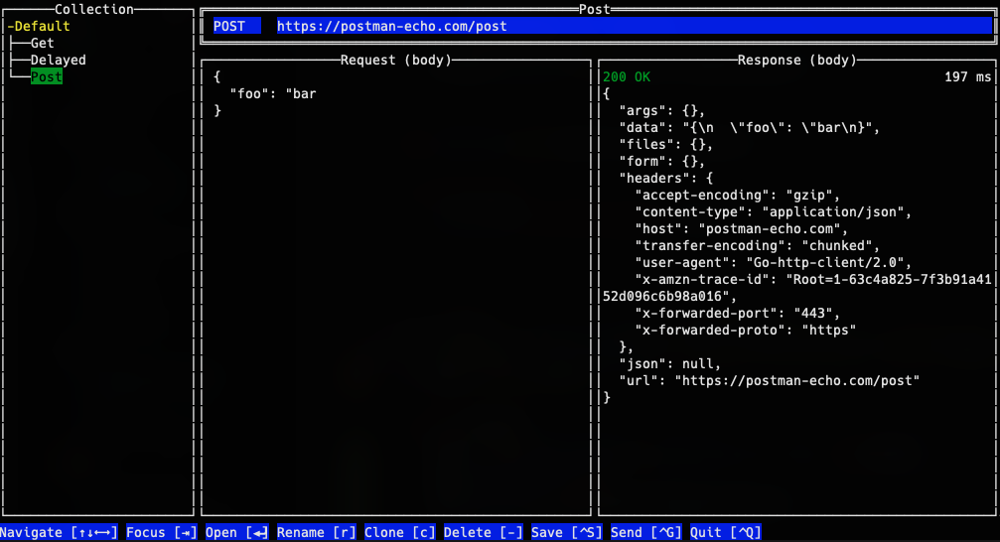

# lull
 
A slick and lean REST client with a keyboard friendly terminal UI.

## About

There are a variety of REST clients out there already, so why this? lull is intended to be a very small and focused
client that provides a keyboard centric interface. Many clients out there have fully featured GUIs and a myriad of 
features, which is great, but for my purposes I was looking for something that I could launch from my command line
and interact with similar to other command line tools (vim, etc.). I was also looking for a weekend project to keep
me busy. :)

Hence, lull was created. Its name has no special meaning; it just happened to come up in a thesaurus when searching
for synonyms of "REST". Short and simple!



The TUI is built thanks to the wonderful [tview](https://github.com/rivo/tview) package!

## Developing

You'll need at least Go 1.19 or newer. Building the client can be done by simply running the following:

```bash
make
```

This will run unit tests and produce a binary `lull` under the `build/` directory. See the `Makefile` for additional 
targets if you want to run tests or the build individually instead.

## Contributing

Interested in helping this project grow? Contributions are always welcome! Before opening a pull request, please first 
create an issue and describe what you are thinking of contributing. This will facilitate a discussion and hopefully
help give some context before new functionality or changes are implemented.

